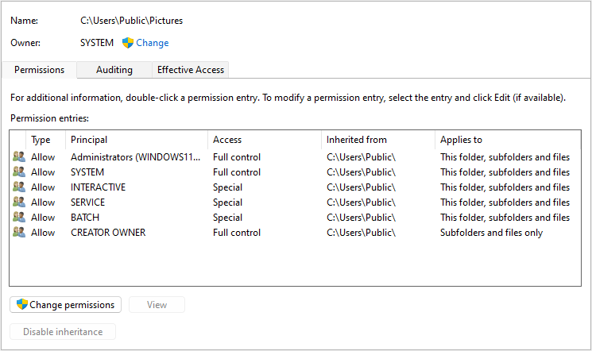
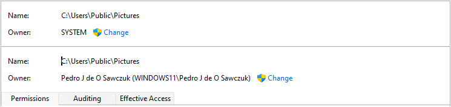
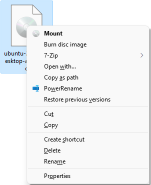

  <h1 align="center">Better With Reg 🧊</h1>
  <h3 align="center">Trying to make windows better with the help of registry editor. 👨‍💻</h3>

### What can I change in Windows 🪟?

  
Associate Files with no Extension to VSCode / Notepad++ / VSCodium

  <h3 align="left">😵‍💫</h3>
  <h4 align="left">This item has no description yet.</h4>

  
Add 'Take Ownership' Context Menu

   
   
Created by: Walter Glenn 
For How-To Geek

Article: [https://www.howtogeek.com/howto/windows-vista/add-take-ownership-to-explorer-right-click-menu-in-vista/](https://www.howtogeek.com/howto/windows-vista/add-take-ownership-to-explorer-right-click-menu-in-vista/)

  
Add 'Hash' Context Menu

   
Created by: Shawn Brink 
Created on: March 5th 2017

Tutorial: [https://www.tenforums.com/tutorials/78681-file-hash-context-menu-add-windows-8-windows-10-a.html](https://www.tenforums.com/tutorials/78681-file-hash-context-menu-add-windows-8-windows-10-a.html)

  
Enable LongPath

  <h3 align="left">🥺</h3>
  <h4 align="left">This item has no description yet.</h4>

  
Enable DNS over HTTPS

  <h3 align="left">😭</h3>
  <h4 align="left">This item has no description yet.</h4>

  
Remove Lock Screen

  <h3 align="left">😣</h3>
  <h4 align="left">This item has no description yet.</h4>

  
Disable Web Searches

  <h3 align="left">😫</h3>
  <h4 align="left">This item has no description yet.</h4>

  
Disable 'Action Center'

  <h3 align="left">😩</h3>
  <h4 align="left">This item has no description yet.</h4>

  
Disable the 'Recently Added Apps'

  <h3 align="left">😧</h3>
  <h4 align="left">This item has no description yet.</h4>

  
Disable Logon Background Image

  <h3 align="left">😧</h3>
  <h4 align="left">This item has no description yet.</h4>

  
Enable 'Windows Photo Viewer' on Windows 10

  <h3 align="left">😧</h3>
  <h4 align="left">This item has no description yet.</h4>

  
Remove " - Shortcut" Text on Create Shortcuts

  <h3 align="left">😧</h3>
  <h4 align="left">This item has no description yet.</h4>
Created by: Walter Glenn 
For How-To Geek

Article: [http://www.howtogeek.com/281753/how-to-remove-the-shortcut-text-from-new-shortcuts-in-windows/](http://www.howtogeek.com/281753/how-to-remove-the-shortcut-text-from-new-shortcuts-in-windows/)

  
Remove 'Quick Access' from Navigation Pane

  <h3 align="left">😧</h3>
  <h4 align="left">This item has no description yet.</h4>

  
Remove 'HomeGroup' from the Navigation Pane

  <h3 align="left">😧</h3>
  <h4 align="left">This item has no description yet.</h4>

  
Remove 'OneDrive' from Navigation Pane

  <h3 align="left">😧</h3>
  <h4 align="left">This item has no description yet.</h4>

  
Remove '3D Objects' from This PC 64-bit

  <h3 align="left">😧</h3>
  <h4 align="left">This item has no description yet.</h4>

  
Remove 'Documents' from This PC 64-bit

  <h3 align="left">😧</h3>
  <h4 align="left">This item has no description yet.</h4>

  
Remove 'Pictures' from This PC 64-bit

  <h3 align="left">😧</h3>
  <h4 align="left">This item has no description yet.</h4>

  
Remove 'Music' from This PC 64-bit

  <h3 align="left">😧</h3>
  <h4 align="left">This item has no description yet.</h4>

  
Remove 'Videos' from This PC 64-bit

  <h3 align="left">😧</h3>
  <h4 align="left">This item has no description yet.</h4>

  
Remove 'Print' Context Menu

  <h3 align="left">😧</h3>
  <h4 align="left">This item has no description yet.</h4>

  
Remove 'Share' Context Menu

  <h3 align="left">😧</h3>
  <h4 align="left">This item has no description yet.</h4>

  
Remove 'Google Drive' Context Menu

  <h3 align="left">😧</h3>
  <h4 align="left">This item has no description yet.</h4>

  
Remove 'Send To Folder' Context Menu

  <h3 align="left">😧</h3>
  <h4 align="left">This item has no description yet.</h4>

  
Remove 'Include in Library' Context Menu

  <h3 align="left">😧</h3>
  <h4 align="left">This item has no description yet.</h4>

  
Remove 'Edit with Paint 3D' Context Menu

  <h3 align="left">😧</h3>
  <h4 align="left">This item has no description yet.</h4>

  
Remove 'OpenInVisualStudio' Context Menu

  <h3 align="left">😧</h3>
  <h4 align="left">This item has no description yet.</h4>

  
Remove 'Pin To Quick Access' Context Menu

  <h3 align="left">😧</h3>
  <h4 align="left">This item has no description yet.</h4>

  
Remove 'Restore Previous Version' Context Menu

  <h3 align="left">😧</h3>
  <h4 align="left">This item has no description yet.</h4>

  
Remove 'Open in Windows Terminal' Context Menu

  <h3 align="left">😧</h3>
  <h4 align="left">This item has no description yet.</h4>

  
Remove 'Troubleshoot Compatibility' Context Menu

  <h3 align="left">😧</h3>
  <h4 align="left">This item has no description yet.</h4>

  
Remove 'Scan with Windows Defender' Context Menu

  <h3 align="left">😧</h3>
  <h4 align="left">This item has no description yet.</h4>

  
Enable Apps Dark Mode

  <h3 align="left">😧</h3>
  <h4 align="left">This item has no description yet.</h4>

  
Enable System Dark Mode

  <h3 align="left">😧</h3>
  <h4 align="left">This item has no description yet.</h4>

<h3 align="left" style="border-bottom: none">Send us your suggestions 🤝</h3>

  <h3 align="center">⚠️ WARNING ⚠️</h3>
  <h4 align="center">Changing the Windows registry can cause your computer to malfunction.</h4>
  <h4 align="center">Beware of 🐛!!!</h4>

